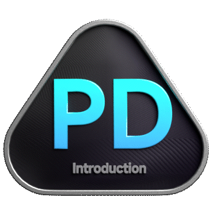

<div align="center">


```ascii
██╗   ██╗██╗   ██╗██╗  ██╗████████╗ █████╗     ██████╗  █████╗ ███╗   ██╗██████╗ ███████╗
╚██╗ ██╔╝██║   ██║██║ ██╔╝╚══██╔══╝██╔══██╗    ██╔══██╗██╔══██╗████╗  ██║██╔══██╗██╔════╝
 ╚████╔╝ ██║   ██║█████╔╝    ██║   ███████║    ██████╔╝███████║██╔██╗ ██║██║  ██║█████╗  
  ╚██╔╝  ██║   ██║██╔═██╗    ██║   ██╔══██║    ██╔══██╗██╔══██║██║╚██╗██║██║  ██║██╔══╝  
   ██║   ╚██████╔╝██║  ██╗   ██║   ██║  ██║    ██████╔╝██║  ██║██║ ╚████║██████╔╝███████╗
   ╚═╝    ╚═════╝ ╚═╝  ╚═╝   ╚═╝   ╚═╝  ╚═╝    ╚═════╝ ╚═╝  ╚═╝╚═╝  ╚═══╝╚═════╝ ╚══════╝
```

### ✦ Data Scientist & AI Developer ✦

[](https://git.io/typing-svg)

<br>

[](https://yukta-bande.vercel.app/)
[](https://www.kaggle.com/yuktaabande)
[](https://in.pinterest.com/yuktaabande/paintings/)
[](https://github.com/yuktabande)

</div>

---

<div align="center">

## 🧬 About Me

</div>

```python
class Yukta:
    name       = "Yukta Bande"
    role       = "Data Scientist & AI Developer"
    languages  = ["Python", "SQL", "R", "Java", "JavaScript"]
    interests  = ["Machine Learning", "Deep Learning", "Data Viz", "Painting 🎨"]
    currently  = "Building something cool with AI 🤖"
    fun_fact   = "I paint with brushes AND with data ✨"

    def say_hi(self):
        print("Thanks for stopping by! Let's build something amazing 🚀")
```

---

<div align="center">

## 🛠️ Tech Stack

</div>

<div align="center">

**Languages & Data**


**ML / AI**


**Visualization & Tools**


</div>

---

<div align="center">

## 🏆 LeetCode Stats

[](https://leetcode.com/u/YuktaBande/)

### 🥇 LeetCode Badges




> 💡 *Solved problems 100+ days in 2025 — consistency is a superpower.*

</div>

---

<div align="center">

## 📊 GitHub Stats


</div>

---

<div align="center">

## 🎨 When I'm Not Coding...

> I paint. Because data tells stories, and so does art.

[](https://in.pinterest.com/yuktaabande/paintings/)

</div>

---

<div align="center">

## 🌐 Find Me Around the Web

| Platform | Link |
|----------|------|
| 🌐 Portfolio | [yukta-bande.vercel.app](https://yukta-bande.vercel.app/) |
| 📊 Kaggle | [kaggle.com/yuktaabande](https://www.kaggle.com/yuktaabande) |
| 🎨 Pinterest | [in.pinterest.com/yuktaabande](https://in.pinterest.com/yuktaabande/paintings/) |
| 💻 GitHub | [github.com/yuktabande](https://github.com/yuktabande) |

<br>


<br>

```
╔══════════════════════════════════════════╗
║        "Built from curiosity."           ║
╚══════════════════════════════════════════╝
```

</div>
